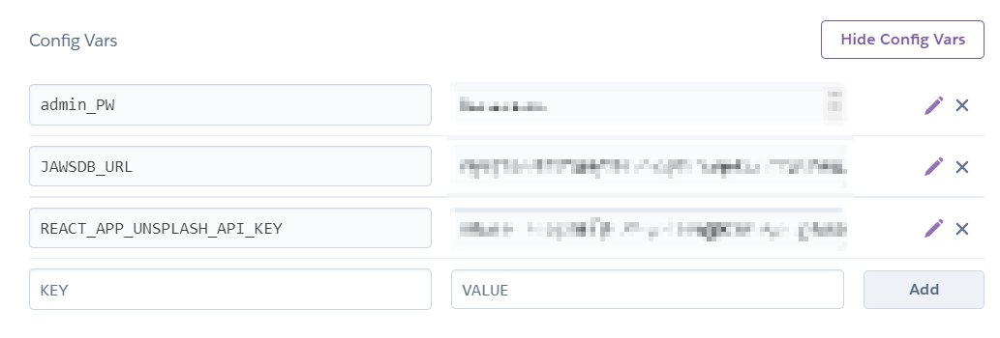
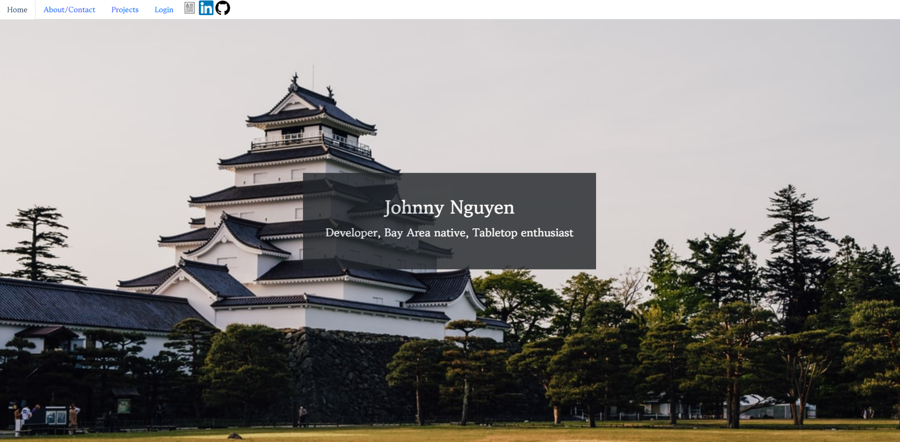

# Johnny Nguyen Portfolio

#
## [Deployed Link](jtn-portfolio.herokuapp.com)

#

## Table of Contents
* [Description](#Description)
* [Installation](#Installation)
* [Usage](#Usage)
* [Credits](#Credits)
* [License](#License)

## Description

Johnny Nguyen's portfolio that contains information about him, links to his work, methods of contacting him, and resume.  Within the links to his work contain various projects and assignments that were done in the UC Berkeley Bootcamp, business, and other personal ventures.

This portfolio is built with React and has a server-side SQL database.

## Installation

To use this repository, clone it to your device via a `git clone` in the terminal/shell.

### Installation for local use (requires MySQL):

<ol>
<li>At the root folder, install required packages via <code>npm install</code> in the terminal. This will install both client and server-side packages.</li>

<li>Note the <code>.env.EXAMPLE</code> files in both the client and server folders.  If you have an <a href="https://unsplash.com/developers">Unsplash</a> API key, insert it into the <i><b>client-side</b></i> <code>.env.EXAMPLE</code> as the value to <code>REACT_APP_UNSPLASH_API_KEY</code>. Rename the file to <code>.env</code>.    

With the <code>.env.EXAMPLE</code> in the <i><b>server-side</b></i>, fill out the <code>ADMIN_PW</code> if running a seed with an administrator user, otherwise fill in your local MySQL password for <code>root</code>. Rename the file to <code>.env</code></li>
<li>Optional: To seed using my seed data, in the root folder, run an <code>npm run seed</code>. Note the administrator user in <code>userSeed.js</code> in the seeders folder that uses <code>ADMIN_PW</code> as an environment variable.  You will get an error seeding if that is not filled out.</li>
<li>Once packages, <code>.env</code>, and, if applicable, seed data are incorporated, run an <code>npm run develop</code> in the root folder.</li>
</ol>

### Installation for Heroku Deployment (Requires a Heroku account)
<ol>
<li>Fork or clone the repository to your own GitHub account.</li>
<li>Launch your Heroku dashboard and on the Apps page. Create a new app with your desired application name.</li>
<li>Open the application dashboard, and at the resources tab, add on the <code>JawsDB MySQL</code> extension.</li>
<li>In the <i>Deploy</i> tab, connect your GitHub in the <i>Deployment Method</i> tab and connect your repository.  Enable automatic deploys if desired.</li>
<li>In the <i>Settings</i> tab, find <i>Config Vars</i>.  There should already be a <code>JAWSDB_URL</code> variable.  Add <code>admin_PW</code> and <code>REACT_APP_UNSPLASH_API_KEY</code> variables with your desired password and your Unsplash API key. </li>
<li>Your application should be ready to deploy.  Make any push into your repository if auto-deploy is enabled, or clone it down to your local machine.  In the root folder, enter <code>heroku git:remote -a YOUR_HEROKU_APP_NAME</code> and do a <code>git push heroku main</code>.</li>
<li>Optional: In the root folder, or in the Heroku CLI, run a <code>heroku run node server/seeders/index.js</code> to seed the JAWSDB database.</li>
</ol>

Config Vars: 

NPM packages required (`npm i` to install all the packages)\

Client-side:\
[React](https://reactjs.org/)\
[jwt-decode](https://www.npmjs.com/package/jwt-decode)

Server-side:\
[bcrypt](https://www.npmjs.com/package/bcrypt)\
[dotenv](https://www.npmjs.com/package/dotenv)\
[jsonwebtokens](https://jwt.io/)\
[concurrently](https://www.npmjs.com/package/concurrently)\
[express](https://www.npmjs.com/package/express)\
[mysql2](https://www.npmjs.com/package/mysql2)\
[sequelize](https://www.npmjs.com/package/sequelize)

## Usage

Projects page is populated through the SQL database.  Adding to to the database will be implemented in the future.  Fetching from the Unsplash API is optional--there are placeholder images in the case of no response from the API.

Example webpage screenshot:

Example mobile demo:

## Credits

[UC Berkeley Bootcamp](https://bootcampspot.com/)\
[Unsplash](https://unsplash.com)\
[w3 Schools](https://www.w3schools.com/)\
[Mozilla](https://developer.mozilla.org/)\
[Heroku](https://www.heroku.com/)\
Lots of googling for answers.

## License

This application is licensed under [MIT](https://opensource.org/licenses/MIT).